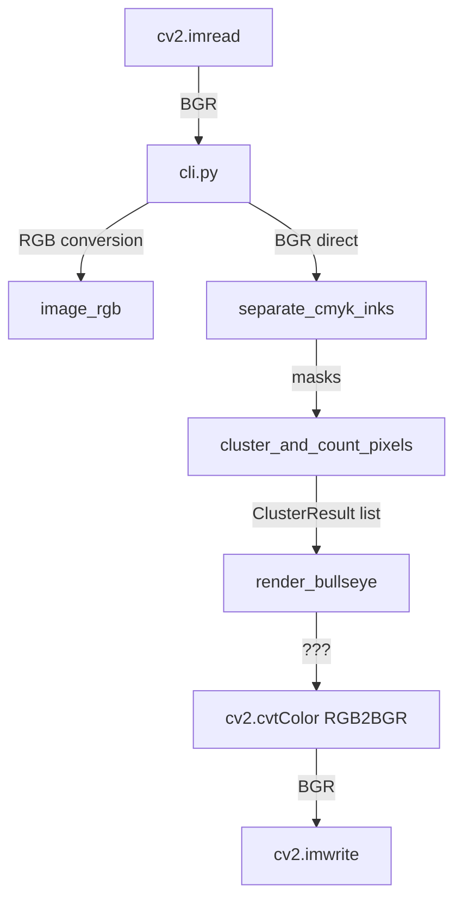
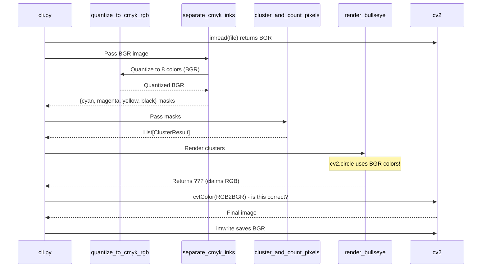

# Documentation Maintenance & Review

## Documentation Scope & Context

* **Related Work:** COLORPIPE sprint - spike-troubleshooting card n8pbv8
* **Documentation Type:** Architecture docs with Mermaid diagrams, code comments, ADR
* **Target Audience:** Engineers working on the detection/reconstitution pipeline

**Required Checks:**
* [x] Related work/context is identified above
* [x] Documentation type and audience are clear
- [x] Existing documentation locations are known (avoid creating duplicates)

---

## Pre-Work Documentation Audit

Before creating new documentation, review what's already there.

| Document Location | Current State | Action Required |
| :--- | :--- | :--- |
| **README.md** | Basic usage, no architecture details | Add link to new docs |
| **docs/** | Does not exist | Create docs/ directory |
| **Code comments** | Inconsistent BGR/RGB claims in docstrings | Fix all docstrings |
| **cluster_renderer.py:87** | Says "Returns RGB numpy array" - may be wrong | Verify and correct |
| **convex_detector.py** | Says "BGR image" but callers inconsistent | Document clearly |

**Documentation Organization Check:**
- [x] No duplicate documentation found across locations
- [x] Documentation follows team's organization standards
- [x] Cross-references between docs are working
- [x] Orphaned or outdated docs identified for cleanup

---

## Documentation Work

| Task | Status / Link to Artifact | Universal Check |
| :--- | :--- | :---: |
| **Create docs/architecture/color-pipeline.md** | Todo | - [ ] Complete |
| **Add Mermaid flowchart of data flow** | Todo | - [ ] Complete |
| **Add Mermaid sequence diagram of reconstitute** | Todo | - [ ] Complete |
| **Fix cluster_renderer.py docstrings** | Todo | - [ ] Complete |
| **Fix convex_detector.py docstrings** | Todo | - [ ] Complete |
| **Create ADR for BGR convention** | Todo | - [ ] Complete |

### Required Mermaid Diagrams

#### 1. Color Pipeline Data Flow (Flowchart)

#### 2. Reconstitute Sequence Diagram

#### 3. BGR vs RGB Format Table
| Stage | Expected Format | Actual Format | Verified? |
|-------|----------------|---------------|-----------|
| cv2.imread output | BGR | BGR | ✅ |
| separate_cmyk_inks input | BGR | BGR | ✅ |
| quantize_to_cmyk_rgb output | BGR | BGR | ✅ |
| render_bullseye COLORS dict | BGR | BGR | ✅ |
| render_bullseye return value | RGB (per docstring) | ??? | ❓ VERIFY |
| cli.py cvtColor argument | RGB | ??? | ❓ VERIFY |

**Documentation Quality Standards:**
- [x] All code examples tested and working
- [x] All commands verified
- [x] All links working (no 404s)
- [x] Consistent formatting and style
- [x] Appropriate for target audience
- [x] Follows team's documentation style guide

---

## Validation & Closeout

| Task | Detail/Link |
| :--- | :--- |
| **Final Location** | docs/architecture/color-pipeline.md |
| **Path to final** | TBD after creation |

### Completion Checklist

- [x] All documentation tasks from work plan are complete
- [x] Documentation is in the correct location (not in root dir)
- [x] Cross-references to related docs are added
- [x] Documentation is peer-reviewed for accuracy
- [x] No doc cruft left behind
- [x] Future maintenance plan identified
- [x] Related work cards are updated (troubleshooting spike)
