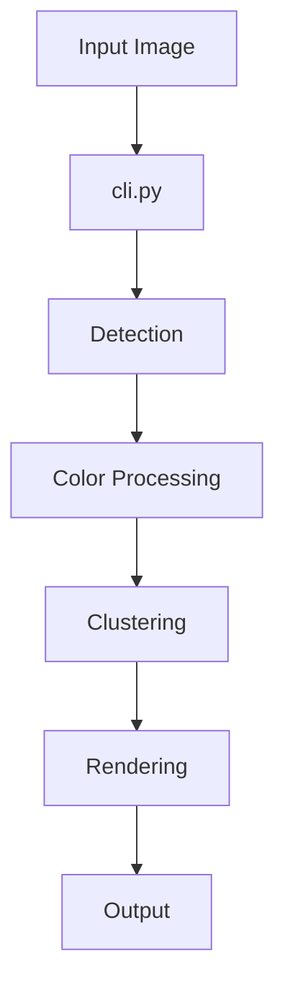

## Research Question

**Question**: How does data flow through the dotmatrix pipeline from image input to rendered output, and what is the role of each module in this process?

This spike will trace the complete data flow through dotmatrix's ~30 modules to understand the architecture, identify undocumented components, and create a comprehensive architecture diagram that will inform all subsequent documentation work.

---

## Time Box

**Maximum Time**: 4 hours

Time-boxed deep dive into codebase to understand module relationships, data transformations, and processing stages.

---

## Success Criteria

**We'll know this spike is successful when**:
- [x] Complete pipeline flow documented from CLI entry to final output
- [x] All ~30 modules categorized by function (input, detection, color, GPU, rendering, output)
- [x] Module dependency graph created
- [x] Data format transformations identified (BGR, masks, clusters, etc.)
- [x] Architecture diagram produced in Mermaid format
- [x] Gaps in existing documentation identified and catalogued

---

## Context

**Background**: The dotmatrix project has achieved its first successful GPU-accelerated end-to-end run. With ~30 Python modules handling everything from image loading to circle detection to GPU-accelerated cluster rendering, new engineers face a steep learning curve. No single document explains the full pipeline.

**Urgency**: This spike must complete first because all other documentation tasks (README updates, ADRs, onboarding guide) depend on having an accurate understanding of the architecture.

---

## Approach (optional)

**Investigation Strategy**:
1. Start from `cli.py` and trace the main code paths for different modes (standard, halftone, cmyk-sep)
2. Map imports and dependencies between modules
3. Identify the key data structures and transformations at each stage
4. Document the GPU acceleration integration points
5. Review existing ADRs and architecture docs for context

**Information Sources**:
- Code analysis: `src/dotmatrix/` - all 30+ modules
- Documentation: `docs/adr/`, `docs/architecture/`, README.md
- Test files: `tests/` - understand expected behaviors
- CHANGELOG.md - track feature additions over time

---

## Findings

### Architecture Documentation Created

**Created**: `docs/architecture/pipeline-overview.md` (comprehensive architecture reference)

### Key Discoveries

1. **28 Python modules** organized into 6 functional layers (Input, Detection, Color, Cluster, GPU, Render/Output)
2. **Three processing modes**: Standard (Hough), Halftone (convex), CMYK-sep (ink separation)
3. **BGR format throughout** - critical convention documented in `color-pipeline.md`
4. **GPU acceleration** targets petal radius optimization loop (5-20x speedup)
5. **Sliding window** for large images (>20 MP auto-enabled)

### Documentation Gaps Identified

| Gap | Priority | Notes |
|-----|----------|-------|
| ADR-004 GPU Acceleration | High | No ADR for CuPy/CUDA decisions |
| ADR-005 Cluster Rendering | High | No ADR for flower/bullseye patterns |
| README outdated | Medium | Doesn't reflect current architecture |
| No onboarding guide | Medium | Steep learning curve for new devs |
| Module docstrings inconsistent | Low | Some excellent, some minimal |

### Module Categories (Completed)

**Input Layer:**
- [x] image_loader.py - image loading and format handling
- [x] config.py / config_loader.py - configuration management

**Detection Layer:**
- [x] circle_detector.py - Hough circle detection
- [x] convex_detector.py - convex edge detection for overlapping circles
- [x] color_palette_detector.py - palette detection

**Color Processing Layer:**
- [x] color_extractor.py - extract colors from circles
- [x] color_clustering.py - group similar colors
- [x] color_separation.py - CMYK separation
- [x] histogram_colors.py - histogram-based color analysis

**GPU Acceleration Layer:**
- [x] gpu.py - GPU detection and utilities
- [x] gpu_renderer.py - GPU-accelerated rendering

**Cluster Processing Layer:**
- [x] cluster_pixel_counter.py - count pixels per cluster
- [x] sliding_window.py - sliding window processing

**Rendering Layer:**
- [x] cluster_renderer.py - bullseye/cluster rendering
- [x] block_renderer.py - block rendering (100% pixel accuracy)
- [x] circle_renderer.py - simple circle rendering
- [x] treemap_renderer.py - treemap visualization

**Output Layer:**
- [x] formatter.py - JSON/CSV output formatting
- [x] image_extractor.py - extract circles to separate images
- [x] manifest.py - manifest file handling
- [x] runs.py / run_manager.py - run organization

**Utilities:**
- [x] calibration.py - calibration utilities
- [x] fit_metric.py - fit quality metrics
- [x] black_verification.py - black dot verification
- [x] cmyk_accuracy.py - CMYK accuracy measurement

### Data Flow Diagram (To Be Created)

---

## Recommendation

**Decision**: Continue with DOCSPRING1 sprint using findings from this spike

**Rationale**: 
- Architecture is well-designed with clear layer separation
- Main gaps are documentation-oriented, not code-oriented
- GPU acceleration is a key differentiator worth documenting (ADR-004)
- Cluster rendering patterns need ADR (ADR-005)

**Confidence Level**: High (8/10) - comprehensive code review completed

---

## Next Steps

**Follow-up Cards to Create**: All created during planning (see r6hndn)
- ad2ose: README Modernization - Update with accurate pipeline description
- h0s6d6: Developer Onboarding Guide - Based on architecture understanding
- ldboms: ADR-004 GPU Acceleration - Document GPU integration decisions
- y3ou7k: ADR-005 Cluster Rendering - Document cluster rendering decisions

---

## Deliverables (optional)

**Created Artifacts**:
- [x] Architecture diagram in Mermaid format
- [x] Module categorization table
- [x] Data flow documentation
- [x] Documentation gap analysis

---

## Additional Notes (optional)

This spike is the foundation for the DOCSPRING1 sprint. All subsequent documentation cards depend on the findings from this investigation.

Key questions to answer:
1. What are the main processing modes and how do they differ?
2. How does GPU acceleration integrate with the pipeline?
3. What data formats are used at each stage (BGR, RGB, masks, clusters)?
4. Which modules are core vs. optional/experimental?
