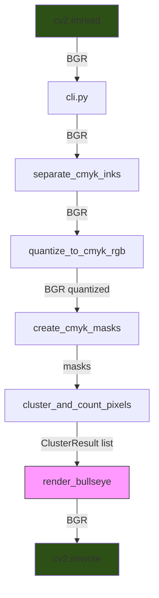
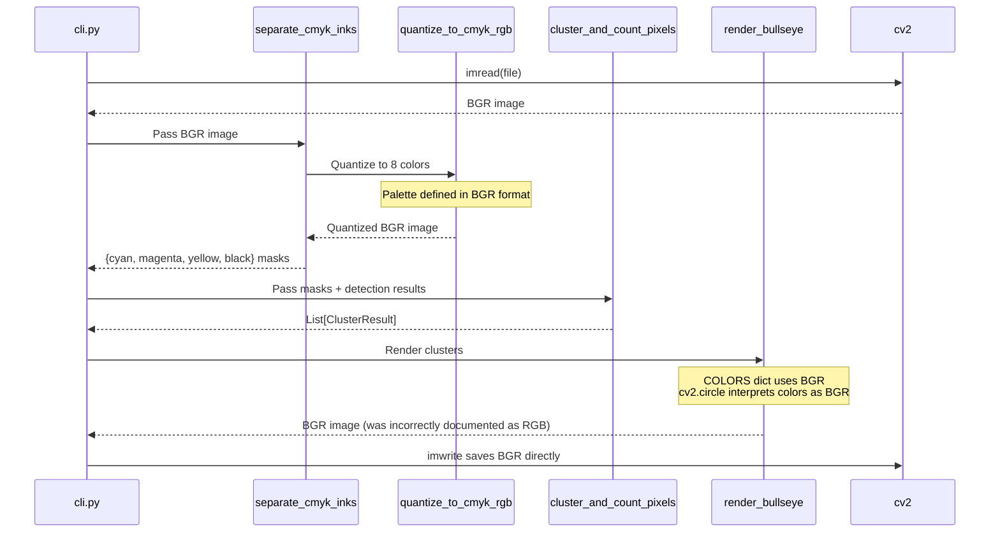

# Color Pipeline Architecture

This document describes the data flow and color format conventions used in the dotmatrix reconstitute pipeline.

## Overview

The reconstitute pipeline converts detected circles back into a visual representation using a bullseye pattern. The key challenge is maintaining consistent color formats (BGR vs RGB) throughout the pipeline.

## Critical Convention: BGR Throughout

**All image data uses BGR format (OpenCV native).** This is the single source of truth.

| Stage | Format | Verified |
|-------|--------|----------|
| cv2.imread output | BGR | Yes |
| quantize_to_cmyk_rgb input/output | BGR | Yes |
| separate_cmyk_inks input | BGR | Yes |
| render_bullseye COLORS dict | BGR | Yes |
| render_bullseye return value | BGR | Yes |
| cv2.imwrite input | BGR | Yes |

## Data Flow Diagram



## Sequence Diagram



## Color Definitions

All 7 colors are defined in BGR format for cv2 compatibility:

```python
# cluster_renderer.py - all 7 colors (CMYK + RGB overlaps)
COLORS = {
    'yellow': (0, 255, 255),    # BGR: B=0, G=255, R=255
    'red': (0, 0, 255),         # BGR: B=0, G=0, R=255 (M∩Y overlap)
    'green': (0, 255, 0),       # BGR: B=0, G=255, R=0 (C∩Y overlap)
    'magenta': (255, 0, 255),   # BGR: B=255, G=0, R=255
    'blue': (255, 0, 0),        # BGR: B=255, G=0, R=0 (C∩M overlap)
    'cyan': (255, 255, 0),      # BGR: B=255, G=255, R=0
    'black': (0, 0, 0),         # BGR: B=0, G=0, R=0
}

# Drawing order: outermost to innermost
LAYER_ORDER = ['yellow', 'red', 'green', 'magenta', 'blue', 'cyan', 'black']

# convex_detector.py - quantization palette
CMYK_RGB_PALETTE = np.array([
    [255, 255, 255],  # White: B=255, G=255, R=255
    [0, 0, 0],        # Black: B=0, G=0, R=0
    [255, 255, 0],    # Cyan: B=255, G=255, R=0
    [255, 0, 255],    # Magenta: B=255, G=0, R=255
    [0, 255, 255],    # Yellow: B=0, G=255, R=255
    [0, 0, 255],      # Red (M+Y): B=0, G=0, R=255
    [0, 255, 0],      # Green (C+Y): B=0, G=255, R=0
    [255, 0, 0],      # Blue (C+M): B=255, G=0, R=0
], dtype=np.uint8)
```

## Common Pitfalls

### 1. Incorrect docstring claims

**Bug discovered:** `cluster_renderer.py` docstrings claimed functions returned "RGB numpy array" when they actually return BGR.

**Resolution:** Fixed docstrings to say "BGR numpy array (cv2 native format)".

### 2. Unnecessary format conversions

**Bug discovered:** cli.py had `cv2.cvtColor(reconstituted, cv2.COLOR_RGB2BGR)` before imwrite, which flipped colors because render_bullseye already returns BGR.

**Resolution:** Removed the conversion - render_bullseye output goes directly to imwrite.

### 3. cv2.circle always uses BGR

`cv2.circle()` interprets the color tuple as BGR regardless of what you consider the image format to be. The image is just a numpy array - OpenCV functions always use BGR.

## Files Reference

| File | BGR Functions |
|------|---------------|
| `convex_detector.py` | `quantize_to_cmyk_rgb()`, `separate_cmyk_inks()` |
| `cluster_renderer.py` | `render_bullseye()`, `render_single_cluster()` |
| `cluster_pixel_counter.py` | `cluster_and_count_pixels()` |
| `cli.py` | Orchestrates pipeline, loads/saves images |

## Testing Color Correctness

```python
import cv2
import numpy as np

# Load reconstituted image
recon = cv2.imread('output/run_xxx/reconstituted.png')

# Check for expected colors (BGR format)
cyan_bgr = (255, 255, 0)
magenta_bgr = (255, 0, 255)
yellow_bgr = (0, 255, 255)

# Count cyan pixels
cyan_mask = np.all(recon == cyan_bgr, axis=-1)
print(f"Cyan pixels: {np.sum(cyan_mask)}")
```

## Related Documentation

- ADR: BGR Convention (to be created)
- COLORPIPE sprint cards: n8pbv8 (spike), jn0k0j (fix), bnjfku (docs)
