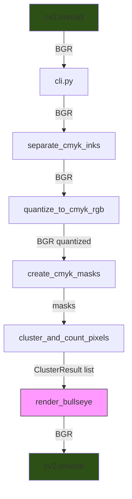
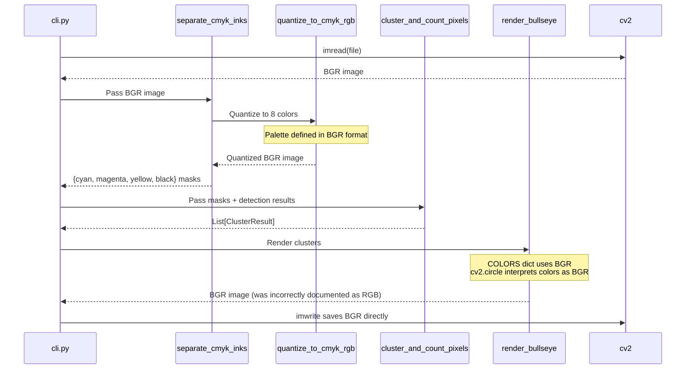

# Color Pipeline Architecture

> **Part of**: [Documentation Index](../README.md) | [Architecture Docs](.)
>
> **Updated**: 2026-01-07 as part of ARCHREVIEW sprint
> **Related**: Architecture spike dbwrwj, rendering-architecture.md

This document describes the data flow, color format conventions, and color processing algorithms used in the dotmatrix pipeline.

## Overview

The color pipeline handles multiple responsibilities:
1. **Color Format Management** - Maintaining BGR consistency throughout cv2 operations
2. **Color Extraction** - Sampling colors from detected circles
3. **Color Clustering** - Grouping similar colors using k-means
4. **Palette Detection** - Auto-detecting dominant colors in halftone images
5. **Color Separation** - Creating per-color masks for CMYK processing

The key challenge is maintaining consistent color formats (BGR vs RGB) throughout the pipeline while interfacing with algorithms that may expect different formats.

## Critical Convention: BGR Throughout

**All image data uses BGR format (OpenCV native).** This is the single source of truth.

| Stage | Format | Verified |
|-------|--------|----------|
| cv2.imread output | BGR | Yes |
| quantize_to_cmyk_rgb input/output | BGR | Yes |
| separate_cmyk_inks input | BGR | Yes |
| render_bullseye COLORS dict | BGR | Yes |
| render_bullseye return value | BGR | Yes |
| cv2.imwrite input | BGR | Yes |

## Data Flow Diagram



## Sequence Diagram



## Color Definitions

All colors are centralized in `src/dotmatrix/colors.py` (since ARCHDEBT sprint 2026-01-08):

```python
# Import centralized colors - use this in all new code
from dotmatrix.colors import COLORS, COLORS_BGR, LAYER_ORDER, LAYER_ORDER_CMYK

# COLORS: 7 colors (CMYK + RGB overlaps) in BGR format
COLORS = {
    'yellow': (0, 255, 255),    # BGR: B=0, G=255, R=255
    'red': (0, 0, 255),         # BGR: B=0, G=0, R=255 (M∩Y overlap)
    'green': (0, 255, 0),       # BGR: B=0, G=255, R=0 (C∩Y overlap)
    'magenta': (255, 0, 255),   # BGR: B=255, G=0, R=255
    'blue': (255, 0, 0),        # BGR: B=255, G=0, R=0 (C∩M overlap)
    'cyan': (255, 255, 0),      # BGR: B=255, G=255, R=0
    'black': (0, 0, 0),         # BGR: B=0, G=0, R=0
}

# COLORS_BGR: Extended set with 'white' for background
COLORS_BGR = { ...COLORS, 'white': (255, 255, 255) }

# Drawing order: outermost to innermost
LAYER_ORDER = ['yellow', 'red', 'green', 'magenta', 'blue', 'cyan', 'black']
LAYER_ORDER_CMYK = ['yellow', 'magenta', 'cyan', 'black']  # 4-color mode
```

> **Note**: Before ARCHDEBT sprint, these were duplicated in each renderer file.
> Always import from `dotmatrix.colors` - never define colors locally.

### Quantization Palette
CMYK_RGB_PALETTE = np.array([
    [255, 255, 255],  # White: B=255, G=255, R=255
    [0, 0, 0],        # Black: B=0, G=0, R=0
    [255, 255, 0],    # Cyan: B=255, G=255, R=0
    [255, 0, 255],    # Magenta: B=255, G=0, R=255
    [0, 255, 255],    # Yellow: B=0, G=255, R=255
    [0, 0, 255],      # Red (M+Y): B=0, G=0, R=255
    [0, 255, 0],      # Green (C+Y): B=0, G=255, R=0
    [255, 0, 0],      # Blue (C+M): B=255, G=0, R=0
], dtype=np.uint8)
```

## Common Pitfalls

### 1. Incorrect docstring claims

**Bug discovered:** `cluster_renderer.py` docstrings claimed functions returned "RGB numpy array" when they actually return BGR.

**Resolution:** Fixed docstrings to say "BGR numpy array (cv2 native format)".

### 2. Unnecessary format conversions

**Bug discovered:** cli.py had `cv2.cvtColor(reconstituted, cv2.COLOR_RGB2BGR)` before imwrite, which flipped colors because render_bullseye already returns BGR.

**Resolution:** Removed the conversion - render_bullseye output goes directly to imwrite.

### 3. cv2.circle always uses BGR

`cv2.circle()` interprets the color tuple as BGR regardless of what you consider the image format to be. The image is just a numpy array - OpenCV functions always use BGR.

## Files Reference

| File | BGR Functions |
|------|---------------|
| `convex_detector.py` | `quantize_to_cmyk_rgb()`, `separate_cmyk_inks()` |
| `cluster_renderer.py` | `render_bullseye()`, `render_single_cluster()` |
| `cluster_pixel_counter.py` | `cluster_and_count_pixels()` |
| `cli.py` | Orchestrates pipeline, loads/saves images |

## Testing Color Correctness

```python
import cv2
import numpy as np

# Load reconstituted image
recon = cv2.imread('output/run_xxx/reconstituted.png')

# Check for expected colors (BGR format)
cyan_bgr = (255, 255, 0)
magenta_bgr = (255, 0, 255)
yellow_bgr = (0, 255, 255)

# Count cyan pixels
cyan_mask = np.all(recon == cyan_bgr, axis=-1)
print(f"Cyan pixels: {np.sum(cyan_mask)}")
```

## Related Documentation

- [Rendering Architecture](rendering-architecture.md) - How renderers consume color data
- [Pipeline Overview](pipeline-overview.md) - System-wide architecture
- ADR-002: Jitter Randomization Strategy (discusses color separation)
- Previous sprint cards: n8pbv8 (spike), jn0k0j (fix), bnjfku (docs)

---

## Color Modules Reference

| Module | Purpose | Key Functions |
|--------|---------|---------------|
| `color_extractor.py` | Sample colors from circles | `extract_color()`, `extract_color_with_palette()` |
| `color_clustering.py` | K-means color grouping | `cluster_colors()` |
| `color_palette_detector.py` | Auto-detect dominant colors | `detect_dominant_colors()` |
| `color_separation.py` | Create color masks | `separate_by_color()`, `create_color_mask()` |
| `convex_detector.py` | CMYK quantization | `quantize_to_cmyk_rgb()`, `separate_cmyk_inks()` |

---

## Color Processing Algorithms

### 1. Color Extraction

Extract colors from detected circles using area or edge sampling:

```python
from dotmatrix.color_extractor import extract_color

# Basic area sampling (average color within circle)
color = extract_color(image, circle)

# Edge sampling for overlapping circles
color = extract_color(image, circle, use_edge_sampling=True)

# Available edge methods:
# - "circumference": Sample evenly around full circle (default)
# - "canny": Sample from actual Canny edge pixels
# - "exposed": Sample only from non-occluded arcs
# - "band": Sample from edge pixel band
```

**When to use each method:**
- **Area sampling**: Best for isolated, non-overlapping circles
- **Edge/circumference**: Better for overlapping circles (avoids neighbor colors)
- **Canny**: Most accurate for anti-aliased edges
- **Exposed**: Best for heavily overlapping circles (CMYK halftones)

### 2. K-Means Color Clustering

Group similar colors to reduce palette complexity:

```python
from dotmatrix.color_clustering import cluster_colors

# Input: Many unique colors
colors = [(255, 0, 0), (250, 5, 5), (245, 10, 0), (0, 255, 0), (5, 250, 5)]

# Output: Mapping to cluster centers
mapping = cluster_colors(colors, n_clusters=2)
# Result: Red variants → (250, 5, 2), Green variants → (2, 252, 2)
```

**Algorithm:**
1. Convert colors to numpy array
2. Run sklearn KMeans with `n_init=10` for stability
3. Map each input color to its cluster center
4. Clamp values to valid RGB range [0, 255]

**Configuration:**
- `n_clusters`: Target number of color groups
- Uses `random_state=42` for reproducibility

### 3. Auto-Palette Detection

Detect dominant colors without manual specification:

```python
from dotmatrix.color_palette_detector import detect_dominant_colors

# Detect 6 most common colors
palette = detect_dominant_colors(
    image,
    n_colors=6,
    exclude_white=True,      # Filter background
    ensure_black=True,       # Always include black if present
    min_presence=0.005,      # Minimum 0.5% of pixels
    sample_step=10,          # Subsample for performance
    bucket_size=20           # Quantization to reduce noise
)
```

**Algorithm:**
1. Subsample image (every Nth pixel) for performance
2. Quantize colors to buckets (reduces anti-aliasing noise)
3. Count color occurrences with Counter
4. Filter out white/near-white background
5. Ensure black is included if present
6. Return top N colors by frequency

### 4. Color Separation

Create per-color binary masks:

```python
from dotmatrix.color_separation import create_color_mask, separate_by_color

# Single color mask
cyan = (255, 255, 0)  # BGR
mask = create_color_mask(image, cyan, tolerance=30)

# Separate into multiple images
colors = [cyan, magenta, yellow, black]
separated = separate_by_color(image, colors, tolerance=30)
# Returns: {color: image_with_only_that_color, ...}
```

**Color Distance:**
- Uses Euclidean distance in RGB space
- `tolerance` is maximum distance to match

---

## Configuration Parameters

Key CLI options that affect color processing:

| Option | Default | Effect |
|--------|---------|--------|
| `--palette` | auto | Color palette: 'auto', 'cmyk', or custom colors |
| `--color-tolerance` | 30 | RGB distance for color matching |
| `--n-colors` | 6 | Number of colors for auto-detection |
| `--edge-sampling` | False | Use edge sampling for color extraction |
| `--edge-method` | circumference | Edge sampling method |

---

## Performance Considerations

1. **Subsample large images**: `detect_dominant_colors` samples every Nth pixel
2. **Quantize colors**: Reduces unique color count before clustering
3. **Use edge sampling sparingly**: More expensive than area sampling
4. **K-means stability**: Uses `n_init=10` for consistent results

---

## GPU Implications

Color processing is primarily CPU-bound (sklearn k-means, numpy operations). GPU acceleration in dotmatrix focuses on rendering, not color processing.

For GPU-accelerated k-means clustering, consider cuML as a future enhancement.

---

## Critical Convention: BGR Throughout
