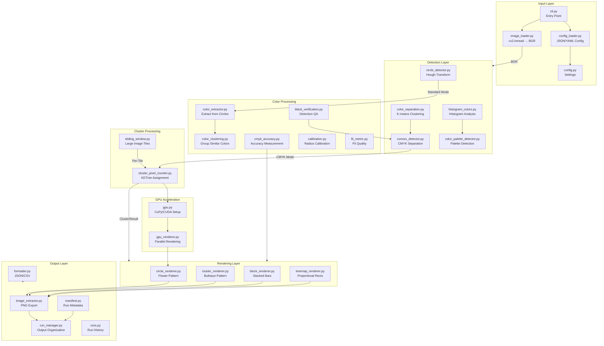

# DotMatrix Pipeline Architecture

> **Part of**: [Documentation Index](../README.md) | [Architecture Docs](.)
>
> **Generated**: 2025-01-XX as part of DOCSPRING1 sprint
> **Status**: Reference documentation for architecture deep dive

## Executive Summary

DotMatrix is a Python CLI for detecting and analyzing circles in images, with specialized support for CMYK halftone patterns. The codebase consists of **28 Python modules** organized into 6 functional layers:

1. **Input Layer** - Configuration loading and image input
2. **Detection Layer** - Circle/shape detection algorithms
3. **Color Processing** - Color extraction and verification
4. **Cluster Processing** - Pixel clustering and counting
5. **GPU Acceleration** - CUDA-based parallel processing
6. **Rendering/Output** - Reconstitution and file generation

## Architecture Diagram



## Processing Modes

DotMatrix supports three primary processing modes, each using different paths through the pipeline:

### 1. Standard Mode (`-m standard`)
**Purpose**: Simple non-overlapping circle detection

**Pipeline Path**:
```
image_loader → circle_detector (Hough) → color_extractor → formatter → output
```

**Key Characteristics**:
- Uses OpenCV's Hough Circle Transform
- Fast (~1.2s for 64 megapixels)
- Best for distinct, non-overlapping circles

### 2. Halftone Mode (`-m halftone`)
**Purpose**: Overlapping CMYK halftone dots

**Pipeline Path**:
```
image_loader → convex_detector → cluster_pixel_counter → circle_renderer → output
```

**Key Characteristics**:
- Uses convex edge detection for overlapping circles
- Handles occlusion through morphological enhancement
- Supports reconstitution (recreating the image from detected data)

### 3. CMYK Separation Mode (`-m cmyk-sep`)
**Purpose**: Ink layer separation with subtractive color logic

**Pipeline Path**:
```
image_loader → convex_detector (CMYK AND logic) → cluster_pixel_counter → [renderer] → output
```

**Key Characteristics**:
- Separates C, M, Y, K ink layers
- Uses subtractive color model (CMY overlaps create RGB)
- Produces layer files: `cyan.png`, `magenta.png`, `yellow.png`, `black.png`

## Module Categorization

### Input Layer (4 modules)

| Module | Purpose | Key Functions |
|--------|---------|---------------|
| `cli.py` | Entry point, CLI options | `cli()`, `_do_detect()` |
| `config_loader.py` | Load JSON/YAML config | `load_config()`, `merge_config_with_cli_args()` |
| `config.py` | Settings dataclass | Configuration constants |
| `image_loader.py` | Image loading | `load_image()` → BGR numpy array |

### Detection Layer (5 modules)

| Module | Purpose | Key Functions |
|--------|---------|---------------|
| `circle_detector.py` | Hough circle detection | `detect_circles()` |
| `convex_detector.py` | CMYK overlapping circles | `detect_circles_cmyk_separation()`, `separate_cmyk_inks()` |
| `color_palette_detector.py` | Auto palette detection | `detect_palette()` |
| `color_separation.py` | K-means color grouping | `get_dominant_colors()` |
| `histogram_colors.py` | Histogram-based analysis | Color histogram utilities |

### Color Processing Layer (6 modules)

| Module | Purpose | Key Functions |
|--------|---------|---------------|
| `color_extractor.py` | Extract colors from circles | `extract_color()` |
| `color_clustering.py` | Group similar colors | Color distance calculations |
| `black_verification.py` | Detection QA for CMYK | `verify_black_dot_detection()` |
| `cmyk_accuracy.py` | Accuracy measurement | `measure_cmyk_accuracy()` |
| `calibration.py` | Radius calibration | Calibration utilities |
| `fit_metric.py` | Circle fit quality | Fit quality metrics |

### Cluster Processing Layer (2 modules)

| Module | Purpose | Key Functions |
|--------|---------|---------------|
| `cluster_pixel_counter.py` | KDTree pixel assignment | `cluster_and_count_pixels()`, `ClusterResult` |
| `sliding_window.py` | Large image tiling | `process_sliding_window()` |

### GPU Acceleration Layer (2 modules)

| Module | Purpose | Key Functions |
|--------|---------|---------------|
| `gpu.py` | CuPy/CUDA setup | `is_gpu_available()`, `get_array_module()` |
| `gpu_renderer.py` | Parallel rendering | `render_flower_global_blend_gpu()` |

### Rendering Layer (4 modules)

| Module | Purpose | Key Functions |
|--------|---------|---------------|
| `circle_renderer.py` | Flower pattern | `render_flower()`, `render_flower_global_blend()` |
| `cluster_renderer.py` | Bullseye pattern | `render_bullseye()` |
| `block_renderer.py` | Stacked bars | `render_blocks()` |
| `treemap_renderer.py` | Proportional rectangles | `render_treemap()`, `render_exact()` |

### Output Layer (5 modules)

| Module | Purpose | Key Functions |
|--------|---------|---------------|
| `formatter.py` | JSON/CSV output | `format_json()`, `format_csv()` |
| `image_extractor.py` | PNG export | `extract_circles_to_images()`, `generate_composite_image()` |
| `manifest.py` | Run metadata | `generate_manifest()`, `write_manifest()` |
| `run_manager.py` | Output directory management | `create_run_directory()` |
| `runs.py` | Run history | Run listing and management |

## Data Format Conventions

### Critical Rule: BGR Throughout

All image data uses **BGR format** (OpenCV native). This is documented in `docs/architecture/color-pipeline.md`.

| Stage | Format |
|-------|--------|
| `cv2.imread` output | BGR |
| All internal processing | BGR |
| Renderer COLORS dicts | BGR |
| `cv2.imwrite` input | BGR |

### Key Data Structures

**ClusterResult** (from `cluster_pixel_counter.py`):
```python
@dataclass
class ClusterResult:
    x: int          # Center X
    y: int          # Center Y
    cyan: int       # Pure cyan pixels
    magenta: int    # Pure magenta pixels
    yellow: int     # Pure yellow pixels
    black: int      # Black pixels
    red: int        # M∩Y overlap
    green: int      # C∩Y overlap
    blue: int       # C∩M overlap
    partial: bool   # Edge cluster flag
    bbox: Optional[Tuple[int, int, int, int]]
```

### Color Palette (BGR Format)
```python
CMYK_RGB_PALETTE = [
    [255, 255, 255],  # White (background)
    [0, 0, 0],        # Black (K)
    [255, 255, 0],    # Cyan (B=255, G=255, R=0)
    [255, 0, 255],    # Magenta (B=255, G=0, R=255)
    [0, 255, 255],    # Yellow (B=0, G=255, R=255)
    [0, 0, 255],      # Red (M∩Y)
    [0, 255, 0],      # Green (C∩Y)
    [255, 0, 0],      # Blue (C∩M)
]
```

## GPU Acceleration Architecture

GPU acceleration is provided through CuPy for CUDA-enabled systems:

1. **Auto-detection**: `gpu.py` checks for CuPy and CUDA availability
2. **Graceful fallback**: All GPU code paths have CPU equivalents
3. **Primary acceleration point**: Petal radius optimization loop in rendering
4. **Performance gain**: 5-20x speedup for large images

### GPU Functions
- `gpu_nms_centers()` - Non-maximum suppression
- `gpu_create_cluster_labels()` - Cluster assignment
- `gpu_count_cluster_colors()` - Parallel pixel counting
- `gpu_distance_transform()` - Distance transform
- `render_flower_global_blend_gpu()` - Full GPU rendering pipeline

## Existing ADRs

| ADR | Topic | Status |
|-----|-------|--------|
| ADR-001 | Large File Processing | Accepted |
| ADR-002 | CLI UX Refactoring | Accepted |
| ADR-002 | Scalability Strategy | Accepted |
| ADR-003 | Block Renderer | Accepted |

### Gaps Identified
- **ADR-004**: GPU Acceleration decisions (to be created)
- **ADR-005**: Cluster Rendering architecture (to be created)

## Performance Characteristics

From ADR-001:

| Mode | Threshold | Memory/MP | Recommended Max |
|------|-----------|-----------|-----------------|
| Hough Detection | >100 MP for 30s | ~5-8 MB | 64+ MP |
| Convex Detection | ~25 MP for 30s | ~20 MB | 20 MP |

### Large Image Handling
- Images >20 MP auto-enable sliding window mode
- Per-tile processing with global deduplication
- Flower renderer used for tile-based output

## Related Documentation

- `docs/architecture/color-pipeline.md` - BGR convention details
- `docs/adr/ADR-001-large-file-processing.md` - Performance thresholds
- `docs/adr/ADR-002-cli-ux-refactoring.md` - CLI design decisions
- `docs/adr/ADR-003-block-renderer.md` - Block renderer rationale
