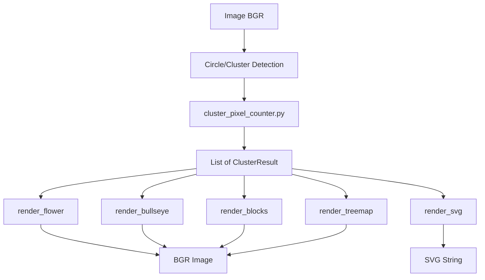

# Rendering Architecture

> **Part of**: [Documentation Index](../README.md) | [Architecture Docs](.)
>
> **Generated**: 2026-01-07 as part of ARCHREVIEW sprint
> **Updated**: 2026-01-08 (ARCHDEBT - centralized colors.py)
> **Related**: Architecture spike dbwrwj, ADR-003, ADR-005

## Overview

DotMatrix provides multiple rendering methods to visualize detected CMYK halftone clusters. Each renderer transforms `ClusterResult` data into visual output, with different trade-offs between visual fidelity, pixel accuracy, and performance.

## Renderer Catalog

| Renderer | Module | Lines | Description | Best For |
|----------|--------|-------|-------------|----------|
| **Flower** | `circle_renderer.py` | 1743 | Black center with CMY petals | Best visual quality |
| **Bullseye** | `cluster_renderer.py` | 153 | Concentric circles | Quick visualization |
| **Block** | `block_renderer.py` | 194 | Stacked horizontal bars | 100% pixel accuracy |
| **Treemap** | `treemap_renderer.py` | 545 | Proportional rectangles | Compact visualization |
| **Exact** | `treemap_renderer.py` | 545 | Pixel-accurate strips | Measurement verification |
| **CMYK-Blend** | `circle_renderer.py` | 1743 | Subtractive color mixing | Print simulation |
| **SVG** | `svg_renderer.py` | 263 | Vector output | Scalable graphics |

## Common Patterns

All raster renderers follow a consistent pattern:

### Batch Renderer Function

```python
def render_<name>(
    clusters: List[ClusterResult],
    image_shape: Tuple[int, int],
    skip_partial: bool = False,
    **renderer_specific_params
) -> np.ndarray:
    """Render all clusters to a single image.
    
    Args:
        clusters: List of ClusterResult from cluster_pixel_counter
        image_shape: (height, width) of output image
        skip_partial: If True, skip clusters at image edges
        
    Returns:
        BGR numpy array (cv2 native format)
    """
    h, w = image_shape
    output = np.full((h, w, 3), 255, dtype=np.uint8)  # White background
    
    for cluster in clusters:
        if skip_partial and cluster.partial:
            continue
        render_single_<name>(cluster, output, **params)
    
    return output
```

### Single Cluster Function

```python
def render_single_<name>(
    cluster: ClusterResult,
    image: np.ndarray,  # Modified in place
    **params
) -> np.ndarray:
    """Render one cluster onto the image."""
    # Get pixel counts from cluster
    # Calculate positions/sizes
    # Draw shapes using cv2 functions
    return image
```

## Data Flow



## ClusterResult Data Structure

The `ClusterResult` dataclass is the central data contract for all renderers:

```python
@dataclass
class ClusterResult:
    """Result for a single halftone cluster."""
    x: int           # Center X coordinate (black dot)
    y: int           # Center Y coordinate (black dot)
    cyan: int        # Cyan pixel count
    magenta: int     # Magenta pixel count
    yellow: int      # Yellow pixel count
    black: int       # Black pixel count
    red: int         # Red overlap (M∩Y) count
    green: int       # Green overlap (C∩Y) count
    blue: int        # Blue overlap (C∩M) count
    partial: bool    # True if cluster is at image edge
    bbox: Optional[Tuple[int, int, int, int]]  # Bounding box
```

**Key Points:**
- Pixel counts have RGB overlap subtracted (no double-counting)
- `partial` flag allows filtering edge clusters
- Location is black dot center (anchor point)

## Color Definitions

All renderers use BGR format for cv2 compatibility:

```python
# Shared color definitions (currently in each renderer)
COLORS = {
    'yellow': (0, 255, 255),    # BGR
    'red': (0, 0, 255),         # M∩Y overlap
    'green': (0, 255, 0),       # C∩Y overlap
    'magenta': (255, 0, 255),
    'blue': (255, 0, 0),        # C∩M overlap
    'cyan': (255, 255, 0),
    'black': (0, 0, 0),
}

LAYER_ORDER = ['yellow', 'red', 'green', 'magenta', 'blue', 'cyan', 'black']
LAYER_ORDER_CMYK = ['yellow', 'magenta', 'cyan', 'black']
```

These color definitions are centralized in `src/dotmatrix/colors.py` and imported by all renderers.

## GPU Acceleration

The flower renderer supports GPU acceleration via CuPy:

```python
# Check GPU availability
from dotmatrix.gpu import is_gpu_available, get_array_module

if is_gpu_available():
    # Use gpu_renderer.py for accelerated rendering
    from dotmatrix.gpu_renderer import render_flower_global_blend_gpu
    result = render_flower_global_blend_gpu(clusters, image_shape, **params)
else:
    # Fall back to CPU
    result = render_flower_global_blend(clusters, image_shape, **params)
```

**GPU Integration Pattern:**
1. Check `is_gpu_available()` before GPU path
2. GPU-specific functions in `gpu_renderer.py`
3. Always provide CPU fallback
4. Use `gpu.py` utilities for array operations

See [ADR-004: GPU Acceleration](../adr/ADR-004-gpu-acceleration.md) for details.

### GPU Drift Correction Optimization (v2)

The `apply_drift_gpu()` function has been optimized to minimize GPU↔CPU data transfers:

**Before (v1):**
- Per-iteration: Upload 3 arrays (px, py, pr), download exposed_counts
- CPU serial loop for adjustment calculations
- Measurement list rebuilt every iteration

**After (v2):**
- Position arrays (px, py) uploaded once before loop (they don't change)
- Target pixels array uploaded once (constant across iterations)
- New CUDA `calculate_adjustments` kernel eliminates CPU serial loop
- Radii updated in-place on GPU
- Only final radii copied back to CPU at the end

**Key CUDA Kernels:**
```cuda
// Measure exposed pixels per petal (unchanged)
void measure_exposed_petals(
    const bool* black_mask,
    const float* px_arr, const float* py_arr, const float* pr_arr,
    int* exposed_counts,
    int n_petals, int width, int height
);

// NEW: Calculate radius adjustments on GPU (replaces CPU loop)
void calculate_adjustments(
    const int* exposed_counts,
    const int* target_pixels,
    float* radii,           // In-place update
    int* needs_adjustment,  // Output for convergence check
    float* squared_errors,  // For RMS calculation
    float drift_tolerance,
    float min_scale,
    float max_scale,
    int n_petals
);
```

**Performance Impact:**
- Memory transfers: 4 arrays/iteration → 1 scalar/iteration (convergence check)
- Computation: O(n) CPU serial → O(1) GPU parallel
- Expected speedup: 2-10x for drift iterations on large images (15K+ clusters)

## Jitter/Randomization

The flower renderer supports jitter for more organic results:

```python
from dotmatrix.jitter import apply_position_jitter, apply_size_jitter

# Position jitter (percentage of radius)
jittered_x, jittered_y = apply_position_jitter(
    x, y,
    position_pct=25,  # 0-100
    base_radius=radius,
    seed=cluster_seed,
    algorithm='gaussian'  # or 'uniform'
)

# Size jitter (percentage of radius)
jittered_radius = apply_size_jitter(
    radius,
    size_pct=20,  # 0-100
    seed=cluster_seed,
    algorithm='gaussian'
)
```

See [ADR-002: Jitter Randomization Strategy](../adr/ADR-002-jitter-randomization-strategy.md) for details.

## Drift Correction

Drift correction adjusts cluster positions to account for systematic positioning errors:

1. **Detection**: Analyze cluster positions for systematic drift patterns
2. **Correction**: Apply offset to each cluster based on position
3. **Integration**: Applied before rendering in `circle_renderer.py`

## How to Add a New Renderer

### Step 1: Create Module

Create `src/dotmatrix/<name>_renderer.py`:

```python
"""<Name> Renderer for CMYK clusters."""

from typing import List, Tuple
import cv2
import numpy as np
from dotmatrix.cluster_pixel_counter import ClusterResult

# Import shared colors (future: from dotmatrix.colors import COLORS)
COLORS = {
    'yellow': (0, 255, 255),
    # ... see above
}
```

### Step 2: Implement Single Cluster Function

```python
def render_single_<name>(
    cluster: ClusterResult,
    image: np.ndarray,
    **params
) -> np.ndarray:
    """Render one cluster."""
    cx, cy = cluster.x, cluster.y
    # Your rendering logic here
    return image
```

### Step 3: Implement Batch Function

```python
def render_<name>(
    clusters: List[ClusterResult],
    image_shape: Tuple[int, int],
    skip_partial: bool = False,
    **params
) -> np.ndarray:
    """Render all clusters."""
    h, w = image_shape
    output = np.full((h, w, 3), 255, dtype=np.uint8)
    
    for cluster in clusters:
        if skip_partial and cluster.partial:
            continue
        render_single_<name>(cluster, output, **params)
    
    return output
```

### Step 4: Add CLI Integration

In `cli.py`, add your renderer to the `--render-method` choice:

```python
@click.option(
    '--render-method',
    type=click.Choice(['bullseye', 'block', 'treemap', 'exact', 'flower', 'planetary', 'cmyk-blend', '<name>']),
    # ...
)
```

### Step 5: Add Tests

Create `tests/test_<name>_renderer.py`:

```python
def test_render_<name>_basic():
    """Test basic rendering."""
    clusters = [create_test_cluster()]
    result = render_<name>(clusters, (100, 100))
    assert result.shape == (100, 100, 3)
    assert result.dtype == np.uint8
```

### Step 6: Document

- Update README.md render methods section
- Consider ADR if significant architectural decisions

## Testing Requirements

All renderers should have tests for:

1. **Empty input**: `render_<name>([], image_shape)` returns white image
2. **Single cluster**: Basic rendering works
3. **Multiple clusters**: Handles multiple clusters
4. **Partial clusters**: `skip_partial` flag works
5. **Edge cases**: Clusters at image boundaries
6. **Output format**: Returns BGR numpy array with correct shape and dtype

## Performance Considerations

1. **Pre-allocate output**: Create output array once, modify in place
2. **Vectorize when possible**: Use numpy operations over loops
3. **Consider GPU**: For large images, GPU acceleration can provide 5-20x speedup
4. **Use cv2 primitives**: cv2.circle, cv2.rectangle are highly optimized

## Related Documentation

- [Pipeline Overview](pipeline-overview.md) - Overall system architecture
- [Color Pipeline](color-pipeline.md) - BGR convention and color handling
- [ADR-003: Block Renderer](../adr/ADR-003-block-renderer.md)
- [ADR-004: GPU Acceleration](../adr/ADR-004-gpu-acceleration.md)
- [ADR-005: Cluster Rendering Pipeline](../adr/ADR-005-cluster-rendering-pipeline.md)
